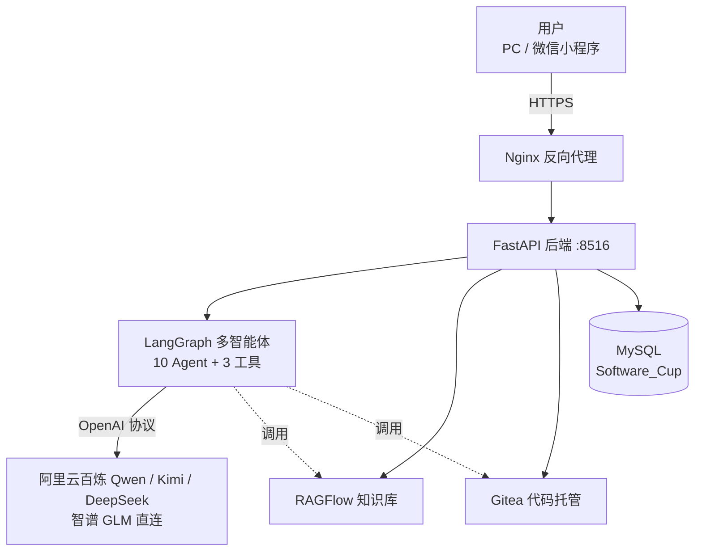
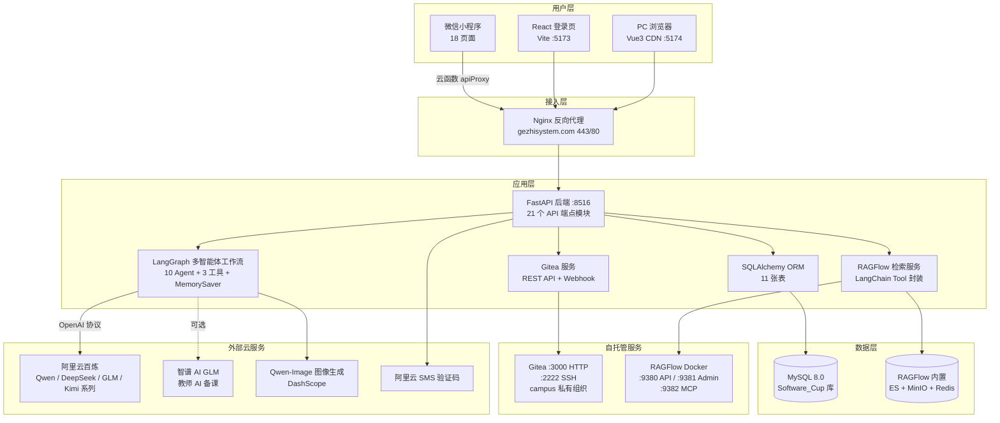
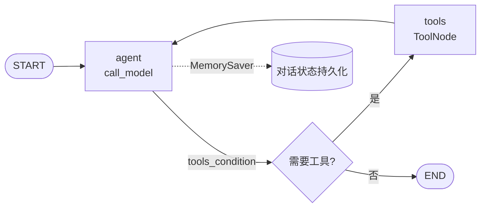
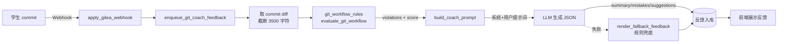

# Intelligence-Competition

> COAI 世界人工智能 开源大赛 | 面向全球开发者、开源社区、高校科研团队

# 格至多智能体协同教育系统

> 驭风团队参赛作品 ｜ **基于多智能体协同的高校计算机课程智能教学平台**
  
>本项目系统已经部署公网服务器

> 融合 LangGraph 多智能体工作流、RAGFlow 自托管知识库、校园 Gitea 团队协作与 AI Git 教练的"教-学-练-评-协"一体化教育系统。

`FastAPI` `LangGraph` `LangChain` `Vue 3` `React + Vite` `RAGFlow` `Gitea` `MySQL` `微信小程序`

**版本** ｜V5｜ **公网域名** https://gezhisystem.com ｜ 

---

## ★ 演示账号
   可选择在本地部署或访问公网域名体验。
   公网域名：https://gezhisystem.com
   或者在本地部署，使用localhost
> **学生账号**：`23001020119`  ｜  **密码**：`123456`
  **教师账号**：`200321`  ｜  **密码**：`123456`
>
> **学生账号**已预置完整演示数据（六维能力图谱、三维度诊断作业、错题本、学习诊断快照、Git 团队项目与校园 Gitea 仓库、排位记录、学术论坛帖子、学习日志等），登录后可完整体验学生端全部核心功能：
> - **AI 多师协同对话**：Alina / Prof.X / CodeNinja 三师协同，苏格拉底启发式问答 + 代码沙箱挖空实战 + AI 算法图解生成 + RAGFlow 课件知识检索
> - **学习诊断**：作业 / 考试错题 / 排位赛 / 沙箱 / Git / 课件六类证据源量化掌握度，生成"基础理解 → 引导练习 → 编程实践 → 独立复测"四阶段个性化学习路径
> - **作业与错题本**：作业提交后三维度 AI 诊断评分（学习路线 / 代码质量 / 理论理解），错题错因诊断与复习路径规划
> - **团队 Git 协作**：团队项目仓库、Clone / 提交记录、AI Git 教练"提交即点评"反馈与贡献进度
> - **排位赛竞技学习**：段位 / 对战记录 / AI 教练冲分策略，错题补强训练闭环
> - **学术空间与知识库**：5 门课程 PDF/PPT 课件浏览，个人 PDF 上传私有库，检索增强问答
> - **学生画像**：六维能力协同图谱、知识点掌握度、Mira AI 引导图可视化导览
> - **考试中心 / 学术论坛 / 学习日志**：模拟测验与成绩分析、发帖交流答疑、学习日志记录
> - **微信小程序**：首页 / 学术空间 / AI 导师 / 我的四大入口，云函数代理与 PC 端数据同步
>
> **教师账号**已预置教师端全链路演示数据，登录后可完整体验"教-学-练-评-协"教师侧闭环：
> - **Bento 全息仪表盘**：课堂签到与催签、AI 预警学生一键下发干预任务、待批改作业与今日授课日程总览
> - **AI 智能备课**：5 门课程课件证据检索与页码引用，AI 生成可编辑教案并支持 Word 导出
> - **作业管理**：作业布置、三维度 AI 诊断评分（学习路线 / 代码质量 / 理论理解）、作业报告师自动生成班级分析报告
> - **学情分析中心**：班级学情聚合看板、学情策略师（Agent）生成干预建议与行动队列，补弱作业 / 短测 / 错题订正直达学生仪表盘
> - **学习诊断复核**：学生诊断快照队列、风险分级、证据评分与教师批注跟进
> - **团队项目与仓库管理**：建项自动创建校园 Gitea 仓库并分配权限，查看提交记录、贡献评估与 AI Git 教练"提交即点评"反馈
> - **考试与论坛管理**：组卷、成绩分析、论坛帖子审核置顶与答疑
>
> 系统启动与数据注入方式见 [第 5 节 · 部署与运行](#5-部署与运行可复现部署指南)。

---

## 目录

- [1. 创新亮点矩阵](#1-创新亮点矩阵)
- [2. 评委快速部署指南](#2-评委快速部署指南)
- [3. 系统总体架构](#3-系统总体架构)
- [4. 核心功能与实现](#4-核心功能与实现)
- [5. 部署与运行（可复现部署指南）](#5-部署与运行可复现部署指南)
- [6. 项目结构目录树](#6-项目结构目录树)
- [7. 测试与质量保障](#7-测试与质量保障)
- [8. 致谢与版权](#8-致谢与版权)

---

## 1. 创新亮点矩阵

本系统针对高校计算机课程"教-学-练-评-协"全链路的痛点，提出 8 项核心创新：

| # | 创新点 | 传统痛点 → 本系统方案 | 技术支撑 |
|---|--------|------------------------|----------|
| 1 | **多智能体协同教学** | 单一 AI 答疑易给完整答案 → Alina 规划师 + Prof.X 启发式导师 + CodeNinja 代码精灵三师协同，执行苏格拉底启发式 + 支架式四阶段教学铁律，每轮必以提问或挖空收尾 | LangGraph `StateGraph` + `MemorySaver` 状态机 |
| 2 | **多模型热插拔路由** | 单模型绑死场景 → 阿里云百炼（Qwen / DeepSeek / GLM / Kimi 系列）+ 智谱 AI 直连双通道按场景分流，支持请求级模型热切换 | `model_registry.py` + `resolve_runtime_model_id` 三级回退 |
| 3 | **校园 Gitea + AI Git 教练闭环** | Git 协作教学靠人工抽查 → 自托管 Gitea + Webhook HMAC 验签 + 规则量化校验 + LLM 点评反馈自动入库，形成"提交即点评"闭环 | `git_coach_service.py` + `git_workflow_rules.py` |
| 4 | **RAGFlow 自托管知识库** | 通用 LLM 幻觉严重 → 5 门课程 PDF/PPT 课件本地化沉淀，其中 3 门核心课程已建 RAGFlow 知识库（DeepDOC 解析），公共库 + 学生私有库双层检索 | RAGFlow Docker + LangChain `@tool` 封装 |
| 5 | **三维度作业诊断** | 单一分数评分 → Alina 学习路线 + CodeNinja 代码质量 + Prof.X 理论理解三 Agent 投票 0-100 评分 + 评语，作业报告师生成班级报告 | 作业诊断师 + 作业报告师 Agent |
| 6 | **学生画像与知识图谱** | 静态学情报表 → 行为抽取 + 知识追踪 + Mira AI 引导图（Qwen-Image）生成可视化导览 | `profile_extractor.py` + `visual_guide_service.py` |
| 7 | **排位赛竞技学习** | 刷题枯燥低效 → 段位 + 对战 + 排位赛 AI 教练冲分策略，错题诊断与补强训练闭环 | `ranked.py` + 排位赛 AI 教练 Agent |
| 8 | **三端协同** | 单端受限 → PC Vue3 CDN 主端 + React/Vite 登录页 + 微信小程序云函数代理多端同步 | 三端 + `cloud/apiProxy` 云函数 |

---

## 2. 评委快速部署指南

### 2.1 三分钟跑通（本地最小启动）

前置：Python 3.11+、Node 18+、MySQL 8.0+。评委无需真实云服务即可体验核心功能。

```bash
# 1. 安装后端依赖
cd backend
python -m venv venv
venv\Scripts\activate                
pip install -r requirements.txt

# 2. 配置环境（Mock 模式，跳过外部云服务）
copy .env.example .env
# 编辑 .env，确认以下开关：
#   SMS_MOCK_ENABLED=true        
#   GITEA_ENABLED=false          
#   QWEN_IMAGE_ENABLED=false     

# 3. 启动后端（数据库表自动创建）
uvicorn app.main:app --host 0.0.0.0 --port 8516 --reload

# 4. 启动前端（另开终端）
cd frontend
python -m http.server 5174
```


> RAGFlow 与 Gitea 为可选依赖，评委跳过不影响主流程体验；完整部署见 [第 5 节](#5-部署与运行可复现部署指南)。
>
> ⚠️ **注意**：仓库内现存的 `backend/.env` 为**生产配置**（SMS Mock 关闭、Gitea / Qwen-Image 开启），评委本地体验请务必执行 `copy .env.example .env` 用示例配置覆盖。

### 2.2 五分钟看懂

**核心架构图**（完整版见 [第 3 节](#3-系统总体架构)）：



**三条典型业务流**：

1. **多智能体对话流**：用户提问 → `call_model` 按消息特征路由模型（含代码→CodeNinja，理论→Prof.X）→ 按需调用工具（知识检索 / 代码沙箱 / 算法图解）→ SSE 流式返回，每轮以提问收尾
2. **团队 Git 协作流**：教师建项 → 自动创建 Gitea 仓库 → 分配 collaborator 权限 → 学生 Clone（HTTPS/SSH 双模式）→ 提交 → Webhook 同步 → AI Git 教练取 diff、规则校验、LLM 点评、反馈入库
3. **作业诊断流**：学生提交作业 → 作业诊断师协同 Alina/CodeNinja/Prof.X 三维度 0-100 评分 → 作业报告师生成班级分析报告（教师建议 + 学生洞察）

### 2.3 重点功能体验路径

登录演示账号 `23001020119` / `123456` 后，推荐体验动线：

1. **AI 对话**：在 AI 导师页输入"解释一下栈"，触发 `generate_algorithm_diagram` 工具生成链表/树/图解，体验苏格拉底启发式教学
2. **代码沙箱**：在右侧沙箱补全挖空代码，`execute_python_code` 工具后台执行并返回结果
3. **团队项目**：进入团队协作页，查看演示账号的 Gitea 仓库、Clone URL、提交记录、AI Git 教练反馈
4. **作业中心**：查看已提交作业的三维度诊断评分与评语
5. **排位赛**：进入排位赛页，查看段位、对战记录、AI 教练冲分策略
6. **学术论坛 / 错题本 / 学生画像**：浏览演示数据

---

## 3. 系统总体架构

### 3.1 全景架构图



### 3.2 技术栈选型表

| 层级 | 组件 | 技术选型 | 版本 | 选型理由 |
|------|------|----------|------|----------|
| 后端框架 | Web 框架 | FastAPI | ≥0.110 | 异步高性能、自动 OpenAPI 文档、依赖注入 |
| 后端框架 | ORM | SQLAlchemy | ≥2.0.29 | 声明式模型、类型安全、迁移支持 |
| 智能体 | 工作流编排 | LangGraph | ≥0.0.35 | StateGraph 状态机、MemorySaver 持久化、工具节点 |
| 智能体 | LLM 接入 | LangChain-OpenAI | ≥0.1.1 | 兼容多厂商 OpenAI 协议、工具绑定、流式输出 |
| 智能体 | LLM 核心库 | LangChain-Core | ≥0.1.42 | `@tool` 工具定义与消息结构 |
| 备课 | 课件解析 | pypdf / python-pptx | ≥5.0 / ≥1.0 | AI 备课的证据检索：PDF/PPT 文本抽取 |
| 备课 | 教案导出 | python-docx | ≥1.1.0 | 教案 Word 文档生成 |
| 知识库 | RAG 引擎 | RAGFlow | Docker 最新 | 自托管、DeepDOC 文档解析、presentation 切分 |
| 代码托管 | Git 服务 | Gitea | Docker 最新 | 轻量自托管、REST API、Webhook、组织权限 |
| 前端 | 主前端框架 | Vue 3 | 3.5+ | CDN 模式零构建、响应式、生态成熟 |
| 前端 | 登录页 | React 18 + Vite 6 | 18.3 / 6.3 | 组件化、TS 支持、shadcn/ui 设计系统 |
| 前端 | 构建工具 | Vite | 6.3 | 登录页构建；主前端用原生 ES Module |
| 前端 | 图表库 | ECharts / Three.js / p5.js | - | 数据可视化、3D 力导向图、生成式艺术 |
| 移动端 | 小程序 | 微信原生 + 云开发 | - | 自定义 tabBar、云函数代理、18 页面 |
| 数据库 | 关系数据库 | MySQL | 8.0+ | 事务可靠、utf8mb4 中文支持 |
| 部署 | 容器编排 | Docker Compose | 24+ | RAGFlow + Gitea 容器化 |
| 部署 | 反向代理 | Nginx | - | HTTPS 终结、SSE 流式支持、路径反代 |
| 云服务 | 短信验证 | 阿里云 dypnsapi | - | 国内到达率高、号码验证服务 |
| 云服务 | 图像生成 | Qwen-Image 2.0 | - | 中文语义理解强、SVG 兜底机制 |

### 3.3 端口与服务清单表

| 服务 | 端口 | 协议 | 用途 | 启动方式 |
|------|------|------|------|----------|
| 后端 API | 8516 | HTTP | FastAPI 主服务，21 个端点模块 | `uvicorn app.main:app --port 8516` |
| PC 前端 | 5174 | HTTP | Vue3 主界面（静态） | `python -m http.server 5174` |
| 登录页 | 5173 | HTTP | React 登录页（开发） | `pnpm dev` |
| Gitea HTTP | 3000 | HTTP | 仓库 Web 管理界面 | `docker run -p 3000:3000` |
| Gitea SSH | 2222 | SSH | Git 推拉代码 | `docker run -p 2222:22` |
| RAGFlow API | 9380 | HTTP | 知识库检索 API | `docker compose --profile cpu up` |
| RAGFlow Admin | 9381 | HTTP | RAGFlow 管理后台 | 同上 |
| RAGFlow MCP | 9382 | HTTP | MCP 服务入口 | 同上 |
| MySQL | 3306 | TCP | 业务数据库 | 本地安装或 Docker |
| Nginx | 80/443 | HTTP/HTTPS | 生产入口（反向代理） | systemd / docker |

### 3.4 多端交互与数据流

**PC 端**：Vue3 CDN 直连后端 `/api`，静态资源（头像、生成的算法图解）走后端 `/static`。前端通过 `frontend/js/config/env.js` 自动识别运行环境：`localhost` → `http://127.0.0.1:8516`，生产 → `https://gezhisystem.com`。

**微信小程序端**：受小程序域名白名单限制，所有 API 请求经云函数 `cloud/apiProxy`（基于 `tcb-admin-node` + `axios`）转发至后端，规避白名单约束并统一鉴权。小程序 18 页面通过自定义 tabBar 组织为"首页 / 学术空间 / AI 导师 / 我的"四大入口。

**三条主数据流**（组件级）：

1. **对话流**：`chat.py` 接收 → `agent_workflow.agent_graph.astream_events` 流式 → `call_model` 路由模型 → `ToolNode` 执行工具 → `chat_history.save_chat_message` 持久化
2. **Git 协作流**：`team_git.py` 建项 → `team_git_service.create_project_repository` 调 Gitea API → `gitea_account_service.ensure_repository_collaborators` 分权限 → Webhook 回调 `apply_gitea_webhook` → `git_coach_service.generate_commit_coach_feedback` AI 点评
3. **作业诊断流**：`homework.py` 接收提交 → `agent_homework_diagnoser` 三 Agent 评分 → `agent_homework_reporter` 班级报告 → 结果写入 `domain_record`

---

## 4. 核心功能与实现

### 4.1 多智能体系统设计

#### 4.1.1 十个智能体清单

系统内置 10 个智能体，定义于 [`backend/app/services/default_agents.py`](backend/app/services/default_agents.py)，覆盖规划、讲授、检索、代码、图像、诊断、报告、策略全链路：

| ID | 名称 | 角色 | 模型 | 职责 |
|----|------|------|------|------|
| `agent_planner` | Alina | 首席规划师 | qwen3.7-max | 分析总体目标，拆解学习路径与待办任务 |
| `agent_tutor` | Prof. X | 知识讲授导师 | qwen3.7-plus | 费曼技巧讲解复杂技术理论与概念 |
| `agent_researcher` | DataBot | 数据检索助手 | qwen3.6-plus | 本地知识库 RAG 检索，提取关键信息 |
| `agent_mistake_analyst` | 错题分析师 | 错题诊断 | qwen3.7-plus | 错因诊断、知识点解释、复习路径规划 |
| `agent_coder` | CodeNinja | 代码演示助手 | kimi-k2.7-code | 高质量带注释代码示例与挖空框架 |
| `agent_visual_guide` | Mira | AI 引导图生成师 | qwen-image-2.0-pro | 概念图与步骤图生成，可视化抽象知识 |
| `agent_ranked_coach` | 排位赛 AI 教练 | 冲分策略 | qwen3.7-plus | 排位诊断、补强训练、限时刷题、赛季冲分 |
| `agent_homework_diagnoser` | 作业诊断师 | 三维度作业诊断 | qwen3.7-plus | 协同三 Agent 投票 0-100 评分 |
| `agent_homework_reporter` | 作业报告师 | 班级报告 | qwen3.7-plus | 班级作业分析报告生成 |
| `agent_analytics_advisor` | 学情策略师 | 干预策略 | qwen3.7-plus | 班级学情干预建议与行动队列 |

#### 4.1.2 LangGraph 工作流

工作流定义于 [`backend/app/services/agent_workflow.py`](backend/app/services/agent_workflow.py)，采用 LangGraph `StateGraph` 状态机：



- **`call_model` 节点**：构建系统提示词（含教学铁律）+ 路由模型 + 流式调用 + 绑定工具
- **`ToolNode` 节点**：执行 Agent 决定调用的工具，结果回灌给 Agent
- **`MemorySaver`**：基于线程 ID 持久化对话状态，实现多轮上下文

#### 4.1.3 模型路由策略

`resolve_runtime_model_id` 实现三级回退，定义于 [`agent_workflow.py`](backend/app/services/agent_workflow.py)：

1. **请求级覆盖**：前端可传 `agent_model` 参数热切换模型，校验通过则采用
2. **Agent 默认模型**：按 `agent_id` 查 `DEFAULT_AGENT_MODELS` 映射
3. **兜底回退**：按消息特征分流（含【用户当前代码】→ CodeNinja 的 `kimi-k2.7-code`，否则→Prof.X 的 `qwen3.7-plus`）

模型注册表 [`model_registry.py`](backend/app/services/model_registry.py) 统一管理 19 个模型配置，覆盖阿里云百炼、智谱 AI、DashScope 三个接入通道（Qwen / DeepSeek / GLM / Kimi 系列），按 `category`（text/image）分类，支持 `has_model` 校验。

#### 4.1.4 内置工具体系

三个 `@tool` 装饰的 LangChain 工具，供 Agent 自动调用：

| 工具 | 功能 | 安全机制 |
|------|------|----------|
| `query_data_structure_knowledge` | RAGFlow 知识库检索 | 公共库 + 学生私有库双层过滤 |
| `execute_python_code` | 子进程隔离执行 Python | 黑名单拦截 `os.system`/`subprocess`/`rmtree`/`shutil`/`socket`/`sys.exit`，5 秒超时 |
| `generate_algorithm_diagram` | matplotlib + networkx 生成链表/二叉树/图 | 透明背景 PNG，存入 `static/generated/` |

#### 4.1.5 教学铁律

系统提示词（`build_system_prompt`）强制执行苏格拉底启发式 + 支架式四阶段教学：

1. **单次篇幅限制**：每轮回复严格控制在 200 字以内，每次只解决一个微小概念
2. **苏格拉底提问律**：禁止直接给出完整正确代码或结论，每轮必以提问、追问或伪代码填空收尾
3. **四阶段教学脚手架**：
   - 阶段一（概念引入）：Alina 明确目标，Prof.X 用费曼技巧介绍概念，严禁提供代码
   - 阶段二（直观图解）：判定对错后提供图解（调用 `generate_algorithm_diagram`），抛出逻辑问题
   - 阶段三（代码实战）：CodeNinja 提供挖空代码框架，学生在沙箱补全
   - 阶段四（纠错通关）：根据沙箱执行结果，CodeNinja 启发式引导定位 Bug，通关后 Alina 更新路径

### 4.2 RAGFlow 知识库系统

#### 4.2.1 知识库架构

- **公共库**：3 门核心课程已建 RAGFlow 知识库（人工智能 / 计算机程序设计 / 数据结构），由 `RAGFLOW_COURSE_DATASETS` JSON 配置驱动前端课程选择器
- **学生私有库**：每个学生可上传 PDF 课件至私有库，通过 `repository_id` metadata 隔离
- **课件资源**：`frontend/courses/` 沉淀 5 门课程（AI 技术 / 数据库 / 数据结构 / 计算机程序设计 / 计算机组成原理）的 PDF/PPT 原始课件。因体积较大（约 1GB）不随开源仓库提交，需从网盘资源包下载后放入该目录，见 [5.2.0 大文件资源包](#52-外部依赖部署)

#### 4.2.2 文档处理流程

PDF 课件经 RAGFlow `DeepDOC` 引擎解析，采用 `presentation`（演示文稿）切片方法，配置于 [`rag_service.py`](backend/app/services/rag_service.py)：

```python
PDF_PRESENTATION_PARSER_CONFIG = {
    "layout_recognize": "DeepDOC",
    "raptor": {"use_raptor": False},
}
```

#### 4.2.3 检索流程

[`rag_service.py`](backend/app/services/rag_service.py) 实现：

1. `build_document_metadata`：为上传文档构建 `source/user_id/repository_id/file_type` 元数据
2. `build_repository_metadata_condition`：构建 `repository_id` 过滤条件，实现私有库隔离
3. `guess_cross_languages`：检测中英混合查询，启用跨语言检索
4. 调用 RAGFlow API 检索，返回相关文档片段

#### 4.2.4 LangChain Tool 封装

[`backend/app/tools/ragflow_tool.py`](backend/app/tools/ragflow_tool.py) 将 RAGFlow 检索封装为 `@tool query_data_structure_knowledge`，Agent 可在对话中自动调用，实现"检索增强生成"。

#### 4.2.5 多模式检索策略

| 模式 | 入口 | 适用场景 |
|------|------|----------|
| Agent Canvas | `RAGFLOW_AGENT_ID` | 智能体编排，多步推理 |
| Chat Assistant | `RAGFLOW_CHAT_ID` | 对话助手，绑定知识库 |
| 直接 Dataset 检索 | `RAGFLOW_DATASET_ID` | 绕过 RAGFlow 内部 LLM，直接检索文档 |

### 4.3 校园 Gitea 仓库与 AI Git 教练

本节为本系统最大创新之一，详述团队 Git 协作与 AI 教练闭环。

#### 4.3.1 Gitea 集成架构

[`gitea_service.py`](backend/app/services/gitea_service.py) 封装 Gitea REST API，支持 Mock/Real 双模式（`GITEA_ENABLED` 切换）：

- **Real 模式**：真实 Gitea 服务，管理员 token 调用 API
- **Mock 模式**：返回确定性 mock payload（如 `mock-gitea-token-{username}-...`），无需真实 Gitea 即可运行
- **campus 私有组织**：所有仓库归 `campus` 组织，通过 collaborator 权限分级控制访问

#### 4.3.2 账号体系

[`gitea_account_service.py`](backend/app/services/gitea_account_service.py) 实现校园账号与 Gitea 账号自动绑定：

| 角色 | Gitea 用户名规则 | 邮箱规则 |
|------|------------------|----------|
| 学生 | `stu_{学号}` | `{学号}@gezhi.local` |
| 教师 | `tea_{工号}` | `teacher_{工号}@gezhi.local` |

`GiteaAccountBinding` 表持久化绑定关系，记录 `gitea_user_id`、`token_last_four`、`sync_status`（pending/synced/mock）。

#### 4.3.3 团队协作 Git 工作流

[`team_git_service.py`](backend/app/services/team_git_service.py) 实现全流程：

1. **建项**：教师创建协作项目，自动创建 Gitea 仓库
2. **权限分配**：`ensure_repository_collaborators` 按 `RepoPermission` 分配（leader→admin、member→write、teacher→admin）
3. **Clone URL 双模式**：公网 HTTPS（`GITEA_PUBLIC_BASE_URL`，供学生克隆）+ 内网 SSH（`GITEA_SSH_DOMAIN:2222`，供服务器侧操作）
4. **提交同步**：Webhook 回调 `apply_gitea_webhook` 同步 commit、branch、PR 至本地数据库
5. **贡献评估**：`evaluate_team_contribution` 量化成员提交进度，过滤系统账号

#### 4.3.4 Webhook 事件处理

- **HMAC-SHA256 验签**：[`team_git.py`](backend/app/api/endpoints/team_git.py) 校验 `X-Gitea-Signature` 头，密钥为 `GITEA_WEBHOOK_SECRET`
- **系统账号黑名单**：`_GITEA_SYSTEM_LOGINS` 过滤 `campus-admin`/`gitea-actions`/`teacher`/`bot`/`ci` 等账号，其提交不计入学生进度
- **事件来源标记**：`_is_real_gitea_row` 区分 `gitea`/`gitea_webhook` 真实数据与 `mock` 数据

#### 4.3.5 AI Git 教练闭环

[`git_coach_service.py`](backend/app/services/git_coach_service.py) 实现"提交即点评"闭环，这是本系统的核心创新：



**核心步骤**：
1. `generate_commit_coach_feedback` 主入口：取 commit diff（截断 3500 字符）
2. `evaluate_git_workflow` 规则校验：量化评分（满分 100），按 `severity`（error/warning/info）分级，检查分支命名、commit message 规范、PR 流程
3. `build_coach_prompt` 构建提示词：要求 LLM 输出严格 JSON（`{summary, mistakes, suggestions}`），不评价算法正确性，只评 Git 流程
4. `parse_coach_json` 解析 LLM 输出
5. 反馈入库，前端展示

**LLM 失败兜底**：`render_fallback_feedback` 用规则 violations 生成 fallback 反馈，无 LLM 时系统仍可用。

### 4.4 学生画像与知识图谱

- **画像构建**：[`profile_extractor.py`](backend/app/services/profile_extractor.py) 从学习行为、考试、作业抽取能力指标（知识掌握度、学习节奏、认知风格、错题模式、学习目标、背景），写入 `StudentProfile` 模型
- **知识追踪**：[`user_knowledge_service.py`](backend/app/services/user_knowledge_service.py) 维护知识点掌握度，`UserKnowledge` 模型持久化，支持按知识点查询薄弱项
- **可视化导览**：[`visual_guide_service.py`](backend/app/services/visual_guide_service.py) + Mira Agent（qwen-image-2.0-pro）生成 AI 引导图，将抽象知识结构转译为通俗易懂的概念图与步骤图，帮助学生理解

### 4.5 作业、考试与排位赛

#### 4.5.1 三维度作业诊断

- **作业诊断师**（`agent_homework_diagnoser`）协同三个维度投票评分：
  - Alina（学习路线维度）
  - CodeNinja（代码质量维度）
  - Prof.X（理论理解维度）
- 输出：0-100 评分 + 评语，仅返回 JSON 格式
- **作业报告师**（`agent_homework_reporter`）基于班级作业统计数据、题目错误率、学生提交情况，生成包含教师建议和学生洞察的结构化报告

#### 4.5.2 考试中心

[`exams.py`](backend/app/api/endpoints/exams.py) 提供模拟考试与成绩分析，支持考试创建、作答、评分、成绩查询。

#### 4.5.3 排位赛竞技学习

[`ranked.py`](backend/app/api/endpoints/ranked.py) + 排位赛 AI 教练（`agent_ranked_coach`）：

- 段位系统 + 对战记录 + 排位积分
- AI 教练基于排位积分、段位、对战记录、错题现象、知识点薄弱项，给出错题诊断、补强训练、限时刷题、连胜/连败管理、赛季冲分计划
- 错题诊断与补强训练闭环，避免"刷题枯燥低效"

### 4.6 三端功能架构

#### 4.6.1 学生端功能矩阵

| 模块 | 功能 | 入口组件 |
|------|------|----------|
| AI 对话 | 多智能体协同教学、流式响应、代码沙箱 | `useChat.js`（组合式函数） |
| 学习诊断 | 六类证据源量化掌握度、四阶段学习路径（基础理解 → 引导练习 → 编程实践 → 独立复测） | `StudentLearningDiagnosis.js` + 9 个 `Learning*` 子组件 |
| 学术空间 | 课程资料、知识库浏览 | `StudentAcademicSpace.js` |
| 代码仓库 | 个人/团队仓库管理 | `StudentCodeRepository.js` |
| 考试中心 | 模拟考试、成绩分析 | `StudentExamCenter.js` |
| 学术论坛 | 帖子发布、交流 | `StudentForum.js` |
| 作业 | 提交、三维度诊断 | `StudentHomework.js` |
| 错题本 | 错题诊断、复习路径 | `StudentMistakeBook.js` |
| 排位赛 | 段位、对战、AI 教练 | `CodingSandbox.js`（编码沙箱 + 排位竞技区一体化） |
| 知识库 | PDF 上传、私有库 | `index.html` knowledge 视图 + `utils/knowledgeFiles.js` |
| 学生画像 | 能力指标、可视化导览 | PC 端 `useProfile.js`；小程序 `portrait` 页 |
| 仪表盘 | 今日待办、截止时间、错题复盘 | `index.html` dashboard 视图 + `useDashboard.js` |

#### 4.6.2 教师端功能矩阵

| 模块 | 功能 | 入口组件 |
|------|------|----------|
| 仪表盘 | Bento 网格布局、全息监控、AI 预警干预 | `TeacherDashboard.js` |
| AI 智能备课 | 课件证据检索与页码引用、AI 教案生成、Word 导出 | `TeacherAiLessonPrep.js` |
| 课程管理 | 课程资料、知识库配置 | `TeacherCourseManager.js` |
| 作业管理 | 布置、批改、三维度诊断、班级报告 | `TeacherHomework.js` |
| 考试管理 | 组卷、成绩分析 | `TeacherExamManager.js` |
| 学习诊断复核 | 诊断快照队列、风险分级、证据评分、教师批注 | `TeacherLearningDiagnosisReview.js` |
| 学情分析 | 班级学情、学情策略师干预建议与行动队列 | `TeacherAnalyticsCenter.js` |
| 项目管理 | 团队项目、Gitea 仓库自动创建与权限分配 | `TeacherProjectManager.js` |
| 空间管理 | 论坛管理 + 仓库举报审核聚合入口 | `TeacherSpaceManager.js`（内嵌下述两个子组件） |
| └ 论坛管理 | 帖子审核、置顶、公告 | `TeacherForumManager.js`（子组件） |
| └ 仓库管理 | 项目举报与违规仓库审核 | `TeacherRepositoryManager.js`（子组件） |

#### 4.6.3 微信小程序

[`微信小程序项目文件/`](微信小程序项目文件/) 提供 18 个页面，自定义 tabBar 组织为"首页 / 学术空间 / AI 导师 / 我的"四大入口：

```
splash → login → home（首页）
                → course（学术空间）
                → chat（AI 导师）
                → profile（我的）
                → forum-detail / mistake-book / knowledge-base
                → journal / journal-detail / portrait / knowledge-map
                → homework / homework-detail
                → evaluator / evaluator-detail / evaluator-result
```

云函数 `cloud/apiProxy` 基于 `tcb-admin-node` + `axios` 转发所有 API 请求至后端，规避小程序域名白名单限制。

#### 4.6.4 AI 对话流式交互三级降级

为保证对话体验，前端实现三级降级策略：

1. **SSE 流式**：`astream_events` 逐 token 推送（首选）
2. **分块返回**：流式不可用时分块接收
3. **全量返回**：兜底全量响应

---

## 5. 部署与运行（可复现部署指南）

### 5.1 前置环境要求

| 依赖 | 最低版本 | 用途 | 必需性 |
|------|----------|------|--------|
| Python | 3.11+ | 后端运行时 | 必需 |
| Node.js | 18+ | 登录页构建 | 必需（主前端可纯静态） |
| MySQL | 8.0+ | 业务数据库 | 必需 |
| Docker + Compose | 24+ | RAGFlow / Gitea 容器化 | 可选（有 Mock 模式） |
| Nginx | - | 反向代理 + HTTPS | 生产必需 |

### 5.2 外部依赖部署

#### 5.2.0 大文件资源包（网盘分发，非仓库内容）

开源仓库不含大体积二进制资源，`.gitignore` 已将其排除。体验完整功能需从网盘下载资源包（链接：**待发布后补充**）：

| 资源包 | 体积 | 解压位置 | 用途 |
|--------|------|----------|------|
| 课程课件包 | 约 1GB | `frontend/courses/`（按课程子目录放入） | RAGFlow 知识库建库与 AI 备课证据检索的原始课件 |
| 演示数据包（可选） | - | `D:\软件杯测试数据注入` | `realistic_seed` 批量演示数据（头像、班级学生等）；无此包时仅注入核心演示账号即可，见 5.3.4 |

> 课件包缺失不影响后端启动与核心功能（AI 对话 / 沙箱 / Git 协作 / 排位赛），仅影响 RAGFlow 建库与教师 AI 备课的课件证据检索。

#### 5.2.1 MySQL

```sql
CREATE DATABASE Software_Cup CHARACTER SET utf8mb4 COLLATE utf8mb4_unicode_ci;
-- 默认账号 root/root，与 .env 一致；生产环境请改强密码
```

#### 5.2.2 RAGFlow（Docker Compose）

```bash
cd ragflow/docker
# 首次部署需先生成环境变量文件（仓库仅预留示例）
copy .env.single-bucket-example .env    # Windows；Linux 用 cp
docker compose --profile cpu up -d
```

- 等待 `mysql` 容器 healthy
- 访问 http://127.0.0.1:9380 创建账号
- 创建 API Key，回填 `.env` 的 `RAGFLOW_API_KEY`
- 创建 3 个课程 dataset（人工智能 / 计算机程序设计 / 数据结构），回填 `RAGFLOW_DATASET_ID` 与 `RAGFLOW_COURSE_DATASETS`
- 上传 `frontend/courses/` 下的 PDF 课件（需先从网盘资源包下载，见 [5.2.0](#52-外部依赖部署)），等待 DeepDOC 解析完成

#### 5.2.3 Gitea（Docker）

```bash
docker run -d --name gitea \
  -p 3000:3000 -p 2222:22 \
  -v gitea-data:/data \
  -e GITEA__server__DOMAIN=gezhisystem.com \
  gitea/gitea:latest
```

- 访问 http://127.0.0.1:3000 完成初始化
- 创建 `campus` 组织
- 创建管理员 API Token，回填 `.env` 的 `GITEA_API_TOKEN`
- 设置 Webhook 密钥，回填 `GITEA_WEBHOOK_SECRET`

#### 5.2.4 可选跳过（Mock 模式）

评委无需真实云服务即可体验核心功能，在 `.env` 中设置：

```ini
SMS_MOCK_ENABLED=true        # 短信验证码 Mock，任意 6 位即可登录
GITEA_ENABLED=false          # Gitea 走 Mock，返回确定性 mock payload
QWEN_IMAGE_ENABLED=false     # 图像生成走 SVG 兜底
```

### 5.3 后端配置与启动

#### 5.3.1 `.env.example` 配置说明

将 [`backend/.env.example`](backend/.env.example) 复制为 `.env`，按 8 个分组填写：

**① RAGFlow 配置**

| 变量 | 示例值 | 必需 | 说明 |
|------|--------|------|------|
| `RAGFLOW_API_KEY` | `ragflow-xxxx` | 是 | RAGFlow API 密钥 |
| `RAGFLOW_BASE_URL` | `http://127.0.0.1:9380/api/v1` | 是 | RAGFlow API 地址 |
| `RAGFLOW_AGENT_ID` | `509fd56a...` | 是 | Agent Canvas ID |
| `RAGFLOW_CHAT_ID` | `035ac2dc...` | 是 | Chat Assistant ID |
| `RAGFLOW_DATASET_ID` | `c3505958...` | 是 | 直接检索 Dataset ID |
| `RAGFLOW_PUBLIC_DATASET_IDS` | `85c6dac4...,13683a00...` | 是 | 公共知识库 ID 列表（逗号分隔） |
| `RAGFLOW_COURSE_DATASETS` | `[{"name":"人工智能","id":"..."}]` | 是 | 课程知识库 JSON 配置 |

**② LLM 配置**

| 变量 | 示例值 | 必需 | 说明 |
|------|--------|------|------|
| `OPENAI_API_KEY` | `YOUR_ALIYUN_QWEN_API_KEY_HERE` | 是 | 阿里云 Qwen API Key |
| `OPENAI_API_BASE` | `https://...maas.aliyuncs.com/compatible-mode/v1` | 是 | OpenAI 兼容协议接入点 |
| `LLM_MODEL` | `qwen3.7-max` | 是 | 默认大模型 |
| `LLM_MODEL_MAX` | `qwen3.7-max` | 是 | 最大模型（规划师用） |
| `LLM_MODEL_FLASH` | `qwen3.7-flash` | 是 | 轻量模型（检索用） |
| `QWEN_TEXT_API_KEY` | 空 | 否 | 模型注册表 Qwen 密钥（空则回退 `OPENAI_API_KEY`） |
| `ZHIPU_API_KEY` | 空 | 否 | 模型注册表智谱密钥（空则回退 `AI_LESSON_PREP_API_KEY`） |

**③ 教师端 AI 备课配置（智谱 GLM）**

| 变量 | 示例值 | 必需 | 说明 |
|------|--------|------|------|
| `AI_LESSON_PREP_API_KEY` | `YOUR_ZHIPU_API_KEY_HERE` | 否* | 智谱 API Key（*教师 AI 备课功能必需，未配置时该功能返回 503） |
| `AI_LESSON_PREP_BASE_URL` | `https://open.bigmodel.cn/api/paas/v4` | 否 | 智谱 OpenAI 兼容接入点 |
| `AI_LESSON_PREP_MODEL` | `glm-4.5-air` | 否 | 备课教案生成模型 |
| `AI_LESSON_PREP_MAX_INPUT_TOKENS` | `30000` | 否 | 单次请求最大输入 token |
| `AI_LESSON_PREP_MAX_OUTPUT_TOKENS` | `8000` | 否 | 单次请求最大输出 token |
| `AI_LESSON_PREP_TIMEOUT_SECONDS` | `120` | 否 | 备课请求超时（秒） |

> 学习诊断模块为纯规则引擎实现，无需任何额外环境变量。

**④ Qwen-Image 配置**

| 变量 | 示例值 | 必需 | 说明 |
|------|--------|------|------|
| `QWEN_IMAGE_ENABLED` | `false` | 否 | 图像生成开关，关闭走 SVG 兜底 |
| `QWEN_IMAGE_API_KEY` | `YOUR_ALIYUN_QWEN_IMAGE_API_KEY_HERE` | 否 | Qwen-Image API Key |
| `QWEN_IMAGE_BASE_URL` | `https://dashscope.aliyuncs.com` | 否 | 图像生成服务地址 |
| `QWEN_IMAGE_MODEL` | `qwen-image-2.0-pro` | 否 | 图像生成模型 |
| `QWEN_IMAGE_SIZE` | `1472*1104` | 否 | 生成图像尺寸 |
| `QWEN_IMAGE_ENDPOINT` | `/v1/services/aigc/text2image/image-synthesis` | 否 | DashScope 图像合成端点 |
| `QWEN_IMAGE_TIMEOUT_SECONDS` | `120` | 否 | 图像生成超时（秒） |
| `QWEN_IMAGE_PROMPT_EXTEND` | `true` | 否 | 提示词自动扩写开关 |
| `QWEN_IMAGE_WATERMARK` | `false` | 否 | 生成图像水印开关 |

**⑤ SMS 验证码配置**

| 变量 | 示例值 | 必需 | 说明 |
|------|--------|------|------|
| `SMS_MOCK_ENABLED` | `true` | 是 | Mock 开关，本地开发建议开启 |
| `SMS_CODE_EXPIRE_MINUTES` | `5` | 是 | 验证码有效期（分钟） |
| `SMS_SEND_COOLDOWN_SECONDS` | `60` | 是 | 发送冷却时间（秒） |
| `SMS_MAX_VERIFY_ATTEMPTS` | `5` | 是 | 最大验证尝试次数 |
| `ALIYUN_SMS_ACCESS_KEY_ID` | `YOUR_ALIYUN_SMS_ACCESS_KEY_ID` | 否 | 阿里云 SMS Key（Mock 模式可空） |
| `ALIYUN_SMS_ACCESS_KEY_SECRET` | `YOUR_ALIYUN_SMS_ACCESS_KEY_SECRET` | 否 | 阿里云 SMS Secret |
| `ALIYUN_SMS_SIGN_NAME` | `YOUR_ALIYUN_SMS_SIGN_NAME` | 否 | 短信签名 |
| `ALIYUN_SMS_TEMPLATE_CODE` | `YOUR_ALIYUN_SMS_TEMPLATE_CODE` | 否 | 短信模板 |
| `ALIYUN_SMS_REGION_ID` | `cn-hangzhou` | 否 | 阿里云 SMS 地域 |
| `ALIYUN_SMS_ENDPOINT` | `dypnsapi.aliyuncs.com` | 否 | 阿里云 SMS 服务端点 |

**⑥ 数据库配置**

| 变量 | 示例值 | 必需 | 说明 |
|------|--------|------|------|
| `DB_HOST` | `127.0.0.1` | 是 | MySQL 主机 |
| `DB_PORT` | `3306` | 是 | MySQL 端口 |
| `DB_USER` | `root` | 是 | MySQL 用户名 |
| `DB_PASS` | `root` | 是 | MySQL 密码 |
| `DB_NAME` | `Software_Cup` | 是 | 数据库名 |

**⑦ CORS 配置**

| 变量 | 示例值 | 必需 | 说明 |
|------|--------|------|------|
| `BACKEND_CORS_ORIGINS` | `["http://localhost:5173","http://localhost:5174"]` | 是 | 允许的前端源（支持 JSON 数组或 CSV） |

**⑧ Gitea 配置**

| 变量 | 示例值 | 必需 | 说明 |
|------|--------|------|------|
| `GITEA_ENABLED` | `false` | 是 | Gitea 启用开关 |
| `GITEA_BASE_URL` | `http://127.0.0.1:3000` | 否 | Gitea 内网地址 |
| `GITEA_PUBLIC_BASE_URL` | `https://gezhisystem.com/gitea` | 否 | Gitea 公网地址 |
| `GITEA_SSH_DOMAIN` | `gezhisystem.com` | 否 | SSH 域名 |
| `GITEA_SSH_PORT` | `2222` | 否 | SSH 端口 |
| `GITEA_API_TOKEN` | `your_gitea_api_token_here` | 否 | 管理员 API Token |
| `GITEA_ORG` | `campus` | 否 | 私有组织名 |
| `GITEA_WEBHOOK_SECRET` | `replace_with_a_strong_webhook_secret` | 否 | Webhook HMAC 密钥 |
| `GITEA_SSH_USER` | `git` | 否 | SSH 拉取用户名 |
| `GITEA_DEFAULT_PRIVATE` | `true` | 否 | 新建仓库默认私有 |
| `GITEA_PUBLIC_BACKEND_URL` | `http://127.0.0.1:8516` | 否 | 宿主机回调地址（Docker 场景 Webhook 回调关键配置） |
| `GITEA_SYNC_MAX_BRANCHES` | `20` | 否 | 单仓库同步分支数上限 |

#### 5.3.2 启动命令

```bash
cd backend
python -m venv venv
venv\Scripts\activate                 # Windows
# source venv/bin/activate            # Linux/macOS
pip install -r requirements.txt
copy .env.example .env                # Windows；Linux 用 cp
# 按上表填写 .env
uvicorn app.main:app --host 0.0.0.0 --port 8516 --reload
```

#### 5.3.3 数据库自动初始化

`init_db()` 在应用启动时自动执行（见 [`backend/app/core/init_db.py`](backend/app/core/init_db.py)）：

1. `Base.metadata.create_all`：创建全部 11 张表（10 个模型文件，其中 `user_knowledge.py` 含知识库与文档两张表）
2. `_ensure_columns`：列迁移，补齐 `user_accounts` 表的 `role/phone/real_name/student_id/teacher_id/class_name/avatar_path` 字段
3. `_sync_domain_payloads`：回填仓库首页记录

#### 5.3.4 演示数据注入

```bash
cd backend
# 注入完整演示数据（含演示账号 23001020119）
python scripts/seed_demo_data.py
```

> **注意**：`realistic_seed` 依赖外部数据包 `D:\软件杯测试数据注入`。若评委环境无此数据包，可仅运行 `target_user_demo_seed` 注入核心演示账号：
> ```bash
> python -c "from app.demo_data.target_user_demo_seed import seed_target_user_demo_data; from app.core.database import SessionLocal; db=SessionLocal(); seed_target_user_demo_data(db); db.close()"
> ```

**演示账号**：`23001020119` / 密码 `123456`（见开篇公示）

### 5.4 前端启动

#### 5.4.1 PC 主前端（Vue3 CDN，零构建）

```bash
cd frontend
python -m http.server 5174
```

访问 http://localhost:5174

#### 5.4.2 登录页（React + Vite）

```bash
cd frontend/登录页
pnpm install
pnpm dev
```

访问 http://localhost:5173

#### 5.4.3 API 源切换

[`frontend/js/config/env.js`](frontend/js/config/env.js) 自动识别运行环境：

- `localhost` / `127.0.0.1` / `::1` → `http://127.0.0.1:8516`（本地开发）
- 其他 → `https://gezhisystem.com`（生产）
- 支持运行时覆盖（优先级从高到低）：`import.meta.env.VITE_API_ORIGIN` / `VITE_API_BASE_URL` → `window.__API_ORIGIN__` / `window.__API_BASE_URL__` → `localStorage.apiOrigin` / `API_ORIGIN`

### 5.5 微信小程序部署

1. 微信开发者工具导入 [`微信小程序项目文件/`](微信小程序项目文件/)
2. 开通云开发环境
3. 部署云函数：进入 `cloud/apiProxy/`，安装依赖并上传部署
   ```bash
   cd 微信小程序项目文件/cloud/apiProxy
   npm install
   # 在微信开发者工具中右键 cloud/apiProxy → 上传并部署
   ```
4. 修改 `cloud/apiProxy/config.json` 的后端地址为你的 API 源
5. `app.json` 已配置 18 页面 + 自定义 tabBar

### 5.6 Nginx 反向代理配置（生产）

```nginx
server {
    listen 80;
    server_name gezhisystem.com www.gezhisystem.com;
    return 301 https://$host$request_uri;
}

server {
    listen 443 ssl http2;
    server_name gezhisystem.com www.gezhisystem.com;

    ssl_certificate     /etc/nginx/ssl/gezhisystem.com.pem;
    ssl_certificate_key /etc/nginx/ssl/gezhisystem.com.key;

    # 前端静态资源
    root /var/www/gezhi-frontend;
    index index.html;

    # API 反代
    location /api/ {
        proxy_pass http://127.0.0.1:8516/api/;
        proxy_set_header Host $host;
        proxy_set_header X-Real-IP $remote_addr;
        proxy_set_header X-Forwarded-For $proxy_add_x_forwarded_for;
        proxy_set_header X-Forwarded-Proto $scheme;
        # SSE 流式支持
        proxy_buffering off;
        proxy_cache off;
        proxy_read_timeout 300s;
    }

    # 后端静态资源（头像、生成图）
    location /static/ {
        proxy_pass http://127.0.0.1:8516/static/;
    }

    # Gitea 反代
    location /gitea/ {
        proxy_pass http://127.0.0.1:3000/;
        proxy_set_header Host $host;
        proxy_set_header X-Real-IP $remote_addr;
        proxy_set_header X-Forwarded-For $proxy_add_x_forwarded_for;
        proxy_set_header X-Forwarded-Proto $scheme;
    }

    location / {
        try_files $uri $uri/ /index.html;
    }
}
```

### 5.7 启动顺序与验证清单

**启动顺序**：

| 顺序 | 服务 | 命令 |
|------|------|------|
| 1 | MySQL | 本地服务或 `docker compose up mysql` |
| 2 | RAGFlow | `cd ragflow/docker && docker compose --profile cpu up -d` |
| 3 | Gitea | `docker run -d -p 3000:3000 -p 2222:22 gitea/gitea` |
| 4 | 后端 | `cd backend && uvicorn app.main:app --port 8516 --reload` |
| 5 | 前端 | `cd frontend && python -m http.server 5174` |
| 6 | 小程序 | 微信开发者工具导入运行 |

**验证清单**：

- [ ] `curl http://127.0.0.1:8516/` 返回 `{"status":"running","message":"AI Private Tutor backend service is running.","version":"3.0"}`
- [ ] `curl http://127.0.0.1:8516/api/agents` 返回 10 个 Agent
- [ ] 前端 http://localhost:5174 可访问
- [ ] 演示账号 `23001020119` / `123456` 可登录（SMS Mock 模式任意 6 位验证码）
- [ ] AI 对话流式响应正常（SSE）
- [ ] 团队项目可创建（Mock 模式下 Gitea 返回 mock payload）
- [ ] 代码沙箱可执行 Python 代码

---

## 6. 项目结构目录树

```
软件杯格至多智能体系统/
├── backend/                        # FastAPI 后端 + LangGraph 多智能体
│   ├── app/
│   │   ├── api/
│   │   │   ├── endpoints/          # 21 个 API 端点模块
│   │   │   │   ├── agents.py       # 智能体列表
│   │   │   │   ├── auth.py         # JWT 认证 + SMS
│   │   │   │   ├── chat.py         # AI 对话（流式）
│   │   │   │   ├── team_git.py     # 团队 Git 协作 + Webhook
│   │   │   │   ├── homework.py     # 作业管理
│   │   │   │   ├── exams.py        # 考试中心
│   │   │   │   ├── ranked.py       # 排位赛
│   │   │   │   ├── forum.py        # 学术论坛
│   │   │   │   ├── code_repository.py  # 代码仓库
│   │   │   │   ├── gitea_accounts.py   # Gitea 账号绑定
│   │   │   │   ├── user_center.py  # 用户中心
│   │   │   │   ├── user_knowledge.py   # 知识追踪
│   │   │   │   ├── profile.py      # 学生画像
│   │   │   │   ├── visual_guide.py # 可视化导览
│   │   │   │   ├── analytics.py    # 学情分析
│   │   │   │   ├── dashboard.py    # 仪表盘 + 教师干预任务
│   │   │   │   ├── evaluator.py    # AI 评估
│   │   │   │   ├── journal.py      # 学习日志
│   │   │   │   ├── learning_diagnosis.py           # 学习诊断（学生）
│   │   │   │   ├── teacher_learning_diagnosis.py   # 学习诊断复核（教师）
│   │   │   │   └── teacher_lesson_prep.py          # 教师 AI 备课
│   │   │   └── api.py              # 路由聚合
│   │   ├── core/
│   │   │   ├── config.py           # Pydantic Settings 配置
│   │   │   ├── database.py         # SQLAlchemy 引擎 + Session
│   │   │   ├── security.py         # JWT 签发与校验
│   │   │   ├── init_db.py          # 启动时建表 + 列迁移
│   │   │   ├── responses.py        # 统一响应格式
│   │   │   └── miniprogram_response.py  # 小程序响应适配
│   │   ├── schemas/                # Pydantic 请求/响应模型（chat / 学习诊断 / 备课）
│   │   ├── repositories/           # 数据访问层（json_store 领域记录存取）
│   │   ├── models/                 # 11 张 ORM 表（10 个文件）
│   │   │   ├── user_account.py     # 用户账号
│   │   │   ├── student_profile.py  # 学生画像
│   │   │   ├── chat_message.py     # 聊天消息
│   │   │   ├── gitea_account_binding.py  # Gitea 账号绑定
│   │   │   ├── user_knowledge.py   # 知识追踪
│   │   │   ├── user_rag.py         # 用户 RAG 库
│   │   │   ├── ranked_question.py  # 排位赛题目
│   │   │   ├── code_diagnosis.py   # 代码诊断
│   │   │   ├── domain_record.py    # 领域记录
│   │   │   └── sms_verification_code.py  # SMS 验证码
│   │   ├── services/               # 16 个业务服务
│   │   │   ├── agent_workflow.py   # LangGraph 多智能体工作流
│   │   │   ├── default_agents.py   # 10 个 Agent 定义
│   │   │   ├── model_registry.py   # 多模型路由注册
│   │   │   ├── rag_service.py      # RAGFlow 检索服务
│   │   │   ├── gitea_service.py    # Gitea REST API 封装
│   │   │   ├── gitea_account_service.py  # Gitea 账号绑定
│   │   │   ├── team_git_service.py # 团队 Git 协作
│   │   │   ├── git_coach_service.py    # AI Git 教练
│   │   │   ├── git_workflow_rules.py   # Git 工作流规则
│   │   │   ├── code_repository_service.py  # 代码仓库服务
│   │   │   ├── code_sandbox.py     # 代码沙箱
│   │   │   ├── chat_history.py     # 聊天历史
│   │   │   ├── profile_extractor.py    # 学生画像抽取
│   │   │   ├── user_knowledge_service.py   # 知识追踪服务
│   │   │   ├── visual_guide_service.py # 可视化导览
│   │   │   ├── sms_service.py      # 阿里云 SMS
│   │   │   ├── learning_diagnosis/     # 学习诊断子包（24 模块：工作流 / 证据库 / 规则引擎 / 路径规划 / 教师复核）
│   │   │   └── teacher_lesson_prep/    # AI 备课子包（课件目录检索 / 证据总结 / 教案生成 / Word 导出）
│   │   ├── utils/                  # 工具函数（时区与时间处理）
│   │   ├── tools/
│   │   │   └── ragflow_tool.py     # RAGFlow LangChain Tool 封装
│   │   ├── demo_data/              # 7 套演示数据种子
│   │   ├── static/                 # 头像 / 演示仓库 / 生成图
│   │   └── main.py                 # FastAPI 入口
│   ├── scripts/
│   │   ├── seed_demo_data.py       # 演示数据注入
│   │   ├── seed_learning_diagnosis_demo.py   # 学习诊断演示数据
│   │   ├── inject_target_teacher_homeworks.py  # 教师演示作业注入
│   │   ├── generate_academic_report/   # 学术报告生成
│   │   └── ...                     # 其他数据注入脚本（共 20 个）
│   ├── tests/                      # 50+ unittest（51 个测试文件）
│   ├── requirements.txt
│   └── .env.example
├── frontend/                       # PC 前端
│   ├── js/
│   │   ├── api/                    # API 调用封装
│   │   ├── components/             # Vue3 组件（学生/教师端）
│   │   ├── hooks/                  # 组合式函数
│   │   ├── utils/                  # 工具函数
│   │   ├── config/                 # env.js 环境配置
│   │   ├── data/                   # 模板与 mock 数据
│   │   └── main.js                 # Vue3 入口
│   ├── libs/                       # echarts/three/vue/tailwind/p5/marked/phosphor/3d-force-graph 本地库
│   ├── courses/                    # 5 门课程 PDF/PPT 课件
│   ├── 登录页/                     # React + Vite + shadcn/ui
│   └── tests/                      # 30+ .test.mjs + playwright
├── ragflow/docker/                 # RAGFlow Docker Compose 编排
├── 微信小程序项目文件/              # 18 页面 + cloud/apiProxy 云函数
│   ├── pages/                      # 18 个页面
│   ├── cloud/apiProxy/             # 云函数代理
│   ├── app.json                    # 小程序配置
│   └── custom-tab-bar/             # 自定义 tabBar
└── .gitignore
```

---

## 7. 测试与质量保障

### 7.1 测试体系总览

| 层级 | 框架 | 文件数 | 覆盖范围 | 运行命令 |
|------|------|--------|----------|----------|
| 后端 | unittest + sqlite::memory: | 51 | API / 服务 / 模型 / 安全 / CORS / Webhook 验签 | `cd backend && python -m pytest tests/ -v` |
| 前端 | 原生 .test.mjs + Playwright | 30+ | 组件 / API / 交互 / 布局 / 安全 | `cd frontend && node tests/<test>.test.mjs` |

**关键测试举例**：

| 测试文件 | 覆盖点 |
|----------|--------|
| `test_agent_workflow_routing.py` | 模型路由三级回退、请求级热切换、Agent 默认模型 |
| `test_team_git_api_security.py` | Webhook HMAC-SHA256 验签 |
| `test_gitea_account_service.py` | 账号绑定、token 轮换、collaborator 权限、Webhook 发送者匹配 |
| `test_git_coach_service.py` | AI Git 教练反馈生成、规则校验 |
| `test_cors_config.py` | CORS 解析（JSON/CSV）、尾斜杠处理 |
| `test_sms_auth.py` | SMS 验证码发送、冷却、过期、最大尝试 |
| `test_learning_diagnosis_*`（16 个） | 学习诊断闭环：证据库、规则引擎、路径规划、目标解析、AI 适配、教师复核 |
| `test_teacher_lesson_prep_api.py` / `test_teacher_lesson_prep_catalog.py` | 教师 AI 备课：课件目录检索、教案生成与导出 |
| `test_teacher_learning_diagnosis_placeholder.py` | 教师学习诊断复核队列 |
| `test_mistake_ai_analysis.py` | 错题 AI 分析 |
| `test_realistic_demo_seed.py` 等 6 个 | 各套演示数据注入幂等性 |

### 7.2 运行测试

```bash
# 后端测试
cd backend
python -m pytest tests/ -v
# 或
python -m unittest discover tests

# 前端测试
cd frontend
node tests/academicSpace.test.mjs
# Playwright 测试
python tests/academic_space_playwright.py
```

### 7.3 安全设计体系

| 安全机制 | 实现位置 | 说明 |
|----------|----------|------|
| JWT 认证 | `core/security.py` | 签发与校验 access token |
| CORS 白名单 | `core/config.py` `parse_cors_origins` | 支持 JSON 数组与 CSV，自动去尾斜杠 |
| Gitea Webhook 验签 | `team_git.py` | HMAC-SHA256 校验 `X-Gitea-Signature` |
| 代码沙箱隔离 | `agent_workflow.py` `execute_python_code` + `code_sandbox.py` | 黑名单拦截 `os.system`/`subprocess`/`rmtree`/`shutil`/`socket`/`sys.exit`/`eval`/`exec`/`open`/`__import__` + AST 级 import 校验，5 秒超时 |
| campus 私有组织 | `gitea_service.py` | 所有仓库归 `campus` 组织，collaborator 权限分级（admin/write） |
| 系统账号过滤 | `team_git_service.py` | `_GITEA_SYSTEM_LOGINS` 黑名单，系统账号提交不计入学生进度 |
| 敏感信息隔离 | `.env` + `.gitignore` | 真实密钥仅存 `.env`（已 gitignore），仓库仅留 `.env.example` 占位符 |

--

## 8. 致谢与版权

本系统为"中国软件杯"参赛作品。参赛成员：谢明德，闫泓宇。团队编号：53017333.

**开源依赖致谢**：

- [FastAPI](https://fastapi.tiangolo.com/) — 高性能异步 Web 框架
- [LangGraph](https://github.com/langchain-ai/langgraph) — 多智能体工作流编排
- [LangChain](https://www.langchain.com/) — LLM 应用开发框架
- [RAGFlow](https://ragflow.io/) — 自托管 RAG 引擎
- [Gitea](https://gitea.io/) — 轻量自托管 Git 服务
- [Vue 3](https://vuejs.org/) — 渐进式 JavaScript 框架
- [React](https://react.dev/) + [Vite](https://vitejs.dev/) — 登录页构建
- [ECharts](https://echarts.apache.org/) — 数据可视化
- [Three.js](https://threejs.org/) — 3D 图形
- [python-docx](https://python-docx.readthedocs.io/) — Word 文档生成

**云服务致谢**：阿里云（百炼 LLM 平台 / Qwen-Image / DashScope / SMS）、智谱 AI（GLM 备课模型）。